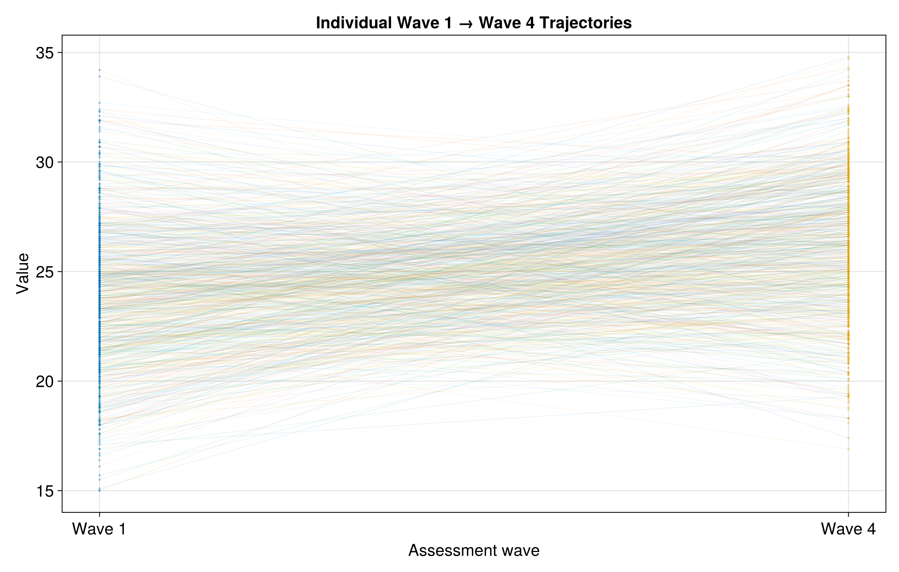
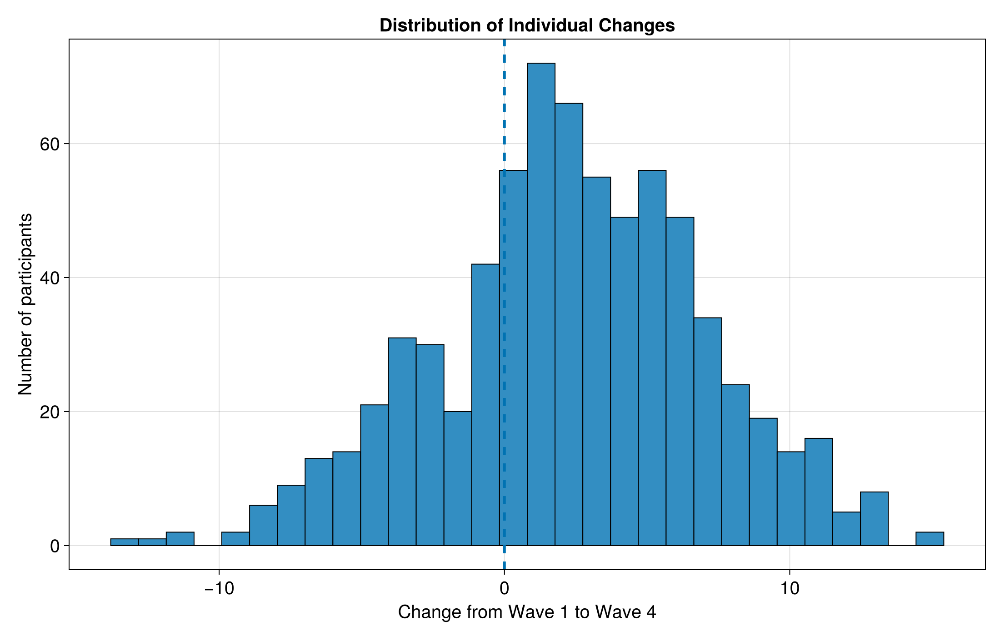
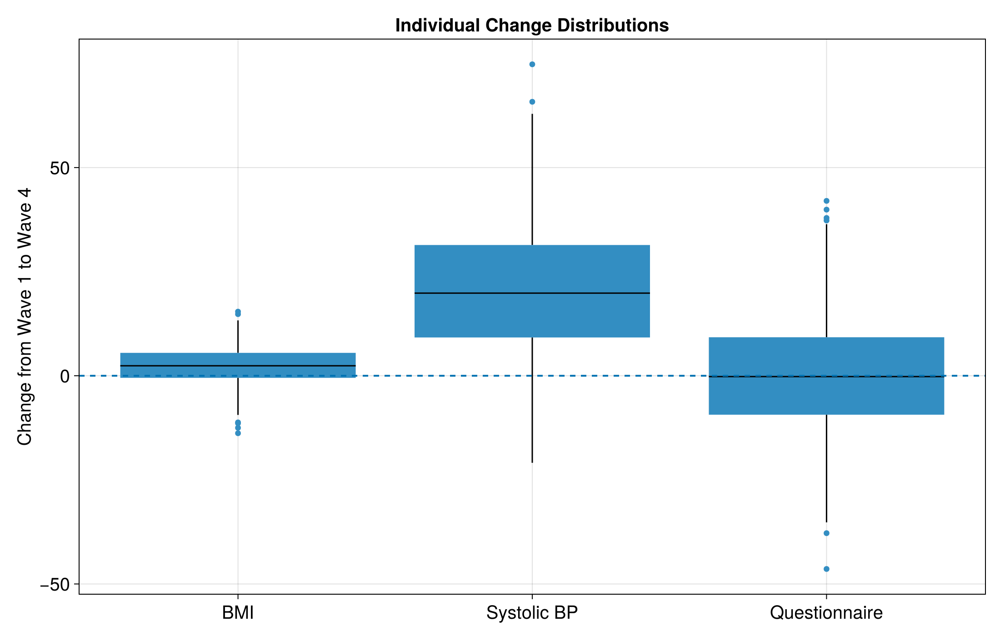

## Figures

The analysis produces figures showing mean changes, individual participant trajectories, and distributions of change.

### Mean change from Wave 1 to Wave 4

<p align="center">
  
</p>

The figure above summarises the mean change between Wave 1 and Wave 4 for BMI, systolic blood pressure, and questionnaire score, with 95% confidence intervals.

### Supporting figures

| Individual BMI trajectories | BMI change distribution |
|---|---|
|  |  |

| Change distributions across outcomes |
|---|
|  |

All figures are generated automatically by:

```bash
julia --project=. scripts/create_figures.jl
```
