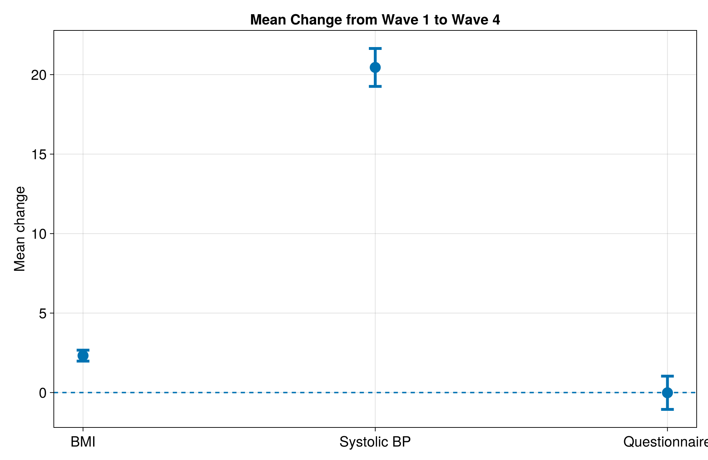

# Longitudinal Health Data Analysis Pipeline

A reproducible Julia pipeline for analysing longitudinal participant data across four assessment waves.

The project demonstrates a complete workflow from data generation and validation through statistical analysis and visualisation. The dataset is **synthetic** and was generated for this project, so no real participant information is used.

## What the project does

The pipeline:

- generates a synthetic longitudinal dataset
- validates participant and assessment data
- produces descriptive summaries
- tracks participant measurements across assessment waves
- compares Wave 1 and Wave 4 measurements
- performs paired statistical tests
- creates publication-style figures
- exports reproducible analysis results
- runs automated tests

The main outcomes are **BMI, systolic blood pressure, and questionnaire score**.

## Dataset

The generated dataset contains:

- **1,000 participants**
- **3,586 assessment records**
- **4 assessment waves**

Raw data are stored in:

```text
data/raw/
├── participants.csv
└── assessments.csv
```

The data are generated by:

```bash
julia --project=. scripts/generate_data.jl
```

## Results

The Wave 1 → Wave 4 analysis includes participants with measurements available at both endpoints.

| Outcome | Complete pairs | Mean change |
|---|---:|---:|
| BMI | 717 | +2.323 |
| Systolic blood pressure | 682 | +20.452 |
| Questionnaire | 707 | −0.013 |

The paired analysis uses a paired t-test, with a Wilcoxon signed-rank test included as a sensitivity analysis.

Detailed results are saved to:

```text
data/processed/statistical_results.csv
```

## Figures

The analysis produces figures showing mean changes, individual participant trajectories, and distributions of change.

### Mean change from Wave 1 to Wave 4



The figure above summarises the mean change between Wave 1 and Wave 4 for BMI, systolic blood pressure, and questionnaire score, with 95% confidence intervals.

### Additional figures

The project also generates:

- **Individual BMI trajectories** — (figures/bmi_individual_trajectories.png)
- **BMI change distribution** — (figures/bmi_change_distribution.png)
- **Change distributions across outcomes** — (figures/change_distributions.png)

All figures are generated automatically by:

```bash
julia --project=. scripts/create_figures.jl
```

## Project structure

```text
longitudinal-research-data-pipeline/
│
├── data/
│   ├── raw/
│   └── processed/
│
├── figures/
│
├── docs/
│   └── data-governance.md
│
├── metadata/
│   └── data_dictionary.csv
│
├── scripts/
│   ├── generate_data.jl
│   ├── run_pipeline.jl
│   └── create_figures.jl
│
├── sql/
│   ├── schema.sql
│   └── queries.sql
│
├── src/
│   ├── validation.jl
│   └── analysis.jl
│
├── test/
│   └── runtests.jl
│
├── Project.toml
├── Manifest.toml
└── README.md
```

## Reproducing the analysis

From the project root:

```bash
julia --project=. scripts/generate_data.jl
julia --project=. scripts/run_pipeline.jl
julia --project=. scripts/create_figures.jl
julia --project=. test/runtests.jl
```

This regenerates the data, runs validation and analysis, creates the figures, and runs the automated test suite.

## Outputs

Processed results are written to:

```text
data/processed/
├── assessment_summary.csv
├── wave_summary.csv
├── participant_trajectories.csv
├── statistical_results.csv
└── research.db
```

The SQLite database contains the `participants` and `assessments` tables. The database schema and analysis queries are available under `sql/`.

## Data documentation

Variable definitions and allowed ranges are provided in:

```text
metadata/data_dictionary.csv
```

Project-level data governance notes are provided in:

```text
docs/data-governance.md
```

The pipeline is designed for synthetic data. Any use with real participant data would require appropriate privacy, governance, and ethical controls.

## Software

The project is written in **Julia**. Package versions are recorded in:

```text
Project.toml
Manifest.toml
```

The project uses packages including **CSV.jl, DataFrames.jl, SQLite.jl, and HypothesisTests.jl**.
